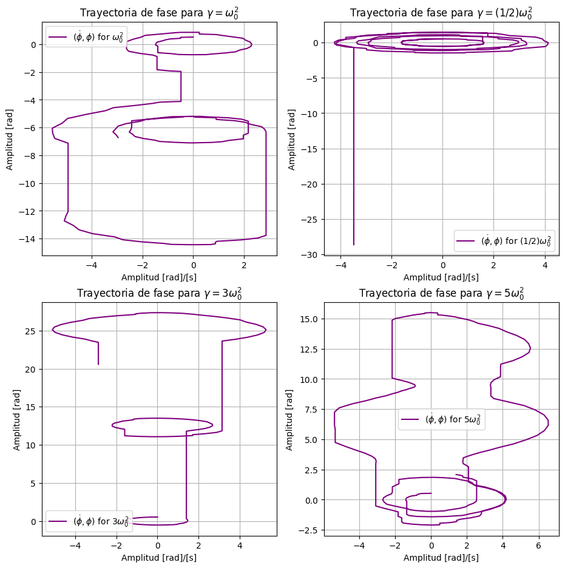
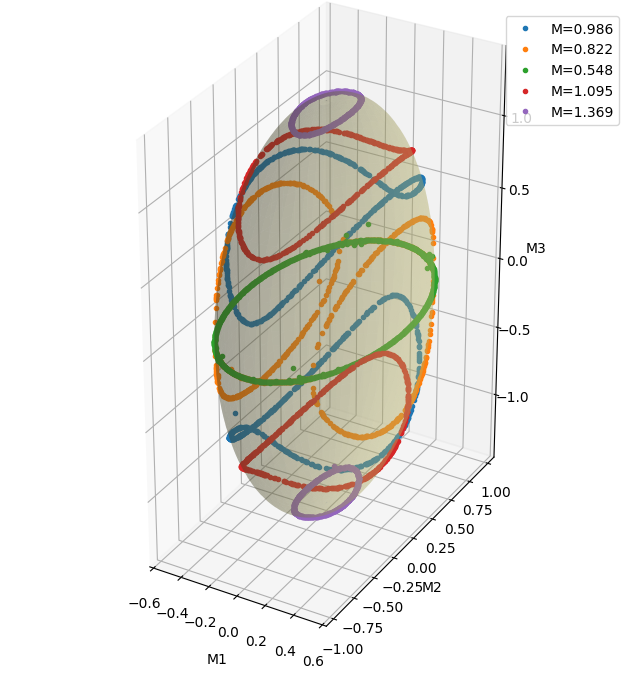
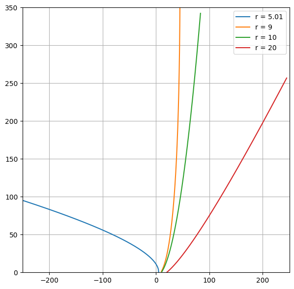
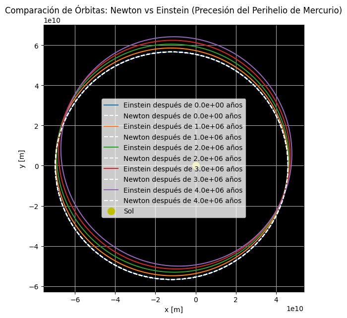

# Advanced Theoretical Mechanics

> A collection of analytical derivations, numerical simulations, and dynamic visualizations in advanced classical mechanics, rigid-body dynamics, Hamilton–Jacobi theory, and relativistic astrophysics.

---

## 📖 Overview

This repository brings together four advanced problems in theoretical physics, combining analytical formulations with numerical simulations and graphical visualization in Python.

The topics span:
- **Non-Inertial Frames & Parametric Oscillators:** Dynamics of a pendulum under time-periodic vertical acceleration (square and sawtooth waveforms), driving frequency stability, and parametric resonance.
- **Rigid-Body Rotational Dynamics:** Torque-free asymmetric top (Euler equations), exact closed-form solutions via Jacobi elliptic functions and theta series, energy-momentum phase-space conservation, and polhode intersections.
- **Hamilton–Jacobi Theory & Nonlinear Potentials:** Canonical transformations, action separation, numerical inversion of quadrature integrals, and orbital trajectory reconstruction in nonlinear central potentials ($V(r) = -GMm/r + k r^{2n}$).
- **Relativistic Astrophysics & Geodesics:** Hamilton–Jacobi formulation in Schwarzschild spacetime, derivation of General Relativistic orbital corrections, and calculation of Mercury's anomalous perihelion precession rate ($42.99''/\text{century}$).

---

## 📚 Problems & Contents

### Problem 1 — Parametric Resonance in a Non-Inertial Frame
**Notebook:** [`Ejercicio1_Mecanica_Teorica.ipynb`](./Ejercicio1_Mecanica_Teorica.ipynb)
**Authors:** Juan Pablo Otálvaro Ghisays, Jose David Ortíz Campo (Universidad de Antioquia)

* **Physical System:** A simple pendulum mounted inside a vehicle undergoing vertical time-dependent acceleration $\vec{a}(t)$.
* **Theoretical Framework:** Non-inertial frame transformation ($\vec{r} = \vec{R} + \vec{r}' \implies \ddot{\vec{r}}' = -\vec{a}(t)$), equivalent effective gravity field $-a(t)\hat{j}$, Lagrangian formulation $L = \frac{1}{2} m l^2 \dot{\phi}^2 + m a(t) l \cos\phi$, and 5th-order series expansion:
  $$ \ddot{\phi} + \omega_0^2(t)\phi = \frac{\omega_0^2(t)}{6}\phi^3 - \frac{\omega_0^2(t)}{120}\phi^5 $$
* **Waveforms Analyzed:** Square-wave acceleration ($a(t) = a_{\text{max}} \cdot \text{sq}(\omega t)$) and Sawtooth-wave acceleration ($a(t) = a_{\text{max}} \cdot \text{saw}(\omega t)$).
* **Computational Methods:** Numerical ODE integration with `scipy.integrate.odeint`, phase-space trajectory generation $(\dot{\phi}, \phi)$, and animated motion rendering via `matplotlib.animation`.
* **Key Findings:** The notebook examines parametric-response regimes for both square-wave and sawtooth-wave acceleration profiles. For sawtooth driving with mean frequency $\omega_0^2 = 9.8\text{ s}^{-2}$, parametric resonance occurs within the narrow frequency window $\gamma = 0.1\omega_0^2 + \epsilon$ for $0 < \epsilon < 0.06$. Beat phenomena (*pulsaciones*) emerge at specific frequencies ($\gamma = 0.02\omega_0^2, 0.003\omega_0^2, 0.108\omega_0^2$).

<p align="center">
  
</p>
<p align="center">
  <em>Representative phase-space trajectories for the parametrically driven pendulum.</em>
</p>

---

### Problem 2 — Torque-Free Motion of an Asymmetric Rigid Body
**Notebook:** [`Ejercicio2_Mecanica_Teorica.ipynb`](./Ejercicio2_Mecanica_Teorica.ipynb)

* **Physical System:** Rotation of an asymmetric rigid top with three distinct principal moments of inertia ($I_3 > I_2 > I_1$) subject to zero external torque ($\vec{\tau} = 0$).
* **Theoretical Framework:** Euler's equations of motion in body-fixed principal axes, simultaneous conservation of rotational kinetic energy $2E = I_1 \Omega_1^2 + I_2 \Omega_2^2 + I_3 \Omega_3^2$ and total angular momentum magnitude $M^2 = I_1^2 \Omega_1^2 + I_2^2 \Omega_2^2 + I_3^2 \Omega_3^2$, exact analytical solutions using Jacobi elliptic functions ($cn, sn, dn$) and Jacobi theta functions ($\vartheta$), and period calculation via the complete elliptic integral of the first kind $K(k)$.
* **Parameters Evaluated:** $I_1 = 0.3$, $I_2 = 0.9$, $I_3 = 2.0$, $E = 0.5\text{ J}$, $M = 1.0\text{ kg}\cdot\text{m}^2/\text{s}$.
* **Computational Methods:** High-precision evaluation with `mpmath` and `scipy.special` (`ellipj`, `ellipk`), numerical peak extraction via `scipy.signal.find_peaks`, 3D surface intersection solver (`scipy.optimize.fsolve`) for momentum spheres and energy ellipsoids, and 3D vector evolution animation.
* **Key Findings:** Exact analytical period calculated as:
  $$ T = 4 K(k) \sqrt{\frac{I_1 I_2 I_3}{(I_3 - I_2)(M^2 - 2E I_1)}} = 7.411\text{ s} $$
  Numerical peak-to-peak extraction confirms $\Omega_1(t)$ and $\Omega_2(t)$ oscillate with period $7.41\text{ s}$ ($T$), while $\Omega_3(t)$ oscillates with period $3.71\text{ s}$ ($T/2$). 3D visualization confirms the angular momentum vector $\vec{M}(t)$ moves along the closed polhode intersection curve.

<p align="center">
  
</p>
<p align="center">
  <em>Energy ellipsoid and angular-momentum sphere intersection for the torque-free asymmetric rigid body.</em>
</p>

---

### Problem 3 — Hamilton–Jacobi Theory in Nonlinear Potentials
**Notebook:** [`Ejercicio3_Mecanica_Teorica.ipynb`](./Ejercicio3_Mecanica_Teorica.ipynb)

* **Physical System:** Planar motion of a particle of mass $m$ in a nonlinear central potential $V(r) = -\frac{GMm}{r} + k r^{2n}$.
* **Theoretical Framework:** Hamilton–Jacobi formalism in polar coordinates $(r, \theta)$, cyclic coordinate $\theta \implies P_\theta = l = \text{const}$ (angular momentum conservation), separation of Hamilton's characteristic function $S(r, \theta, t) = S_r(r) + l \theta - E t$, and canonical transformation parameter quadratures $\beta_1 = \partial S / \partial E$ and $\beta_2 = \partial S / \partial l$.
* **Cases Evaluated:**
  1. **$n = 0$ (Keplerian potential plus constant shift):** Closed-form integration via inverse substitution $u = 1/r$, cubic spline interpolation (`scipy.interpolate.interp1d`), and root-finding (`scipy.optimize.brentq`) for numerical inversion of $t(r)$. Orbit sensitivity evaluated for initial radii $r_0 \in \{5, 9, 10, 20\}$.
  2. **$n = 1/2$ (Linear radial potential term $V(r) = -GMm/r + k r$):** Quadrature integration using `scipy.integrate.quad` over radial bounds $r \in [0.1, 32.1]$.
* **Computational Methods:** Symbolic derivation attempt via `sympy`, numerical quadrature via `scipy.integrate.quad`, cubic spline interpolation, and Brent's root-finding method (`scipy.optimize.brentq`).
* **Key Findings:** The notebook evaluates the reconstructed trajectories for different initial radii ($r_0 \in \{5, 9, 10, 20\}$) in the $n=0$ case and performs trajectory reconstruction for the $n=1/2$ case via numerical radial quadratures.

<p align="center">
  
</p>
<p align="center">
  <em>Reconstructed planar trajectories for the nonlinear central potentials considered in the Hamilton–Jacobi analysis.</em>
</p>

---

### Problem 4 — Perihelion Precession of Mercury in Schwarzschild Spacetime
**Notebook:** [`Ejercicio4_Mecanica_Teorica.ipynb`](./Ejercicio4_Mecanica_Teorica.ipynb)
**Authors:** Juan Pablo Otálvaro Ghisays, Jose David Ortíz Campo (Universidad de Antioquia)

* **Physical System:** Orbital motion of Mercury around the Sun in General Relativity vs. Classical Newtonian Gravitation.
* **Theoretical Framework:** Schwarzschild metric in spherical coordinates ($r_g = \frac{2 G M}{c^2}$), relativistic Hamilton–Jacobi equation $g^{ik} \frac{\partial S}{\partial x^i} \frac{\partial S}{\partial x^k} - m^2 c^2 = 0$, action separation $S = -E t + L \phi + S_r(r)$, and power-series expansion of the radial action integral yielding the relativistic angular advance per revolution:
  $$ \Delta \phi_{\text{per rev}} = \frac{6 \pi G M}{a c^2 (1 - e^2)} $$
* **Physical Parameters (Mercury):** $G = 6.67430 \times 10^{-11} \text{ m}^3\text{kg}^{-1}\text{s}^{-2}$, $c = 2.99792458 \times 10^8 \text{ m/s}$, Solar Mass $M_\odot = 1.989 \times 10^{30} \text{ kg}$, semi-major axis $a = 5.791 \times 10^{10} \text{ m}$, eccentricity $e = 0.2056$, orbital rate $415.2\text{ revolutions/century}$.
* **Computational Methods:** Numerical trajectory evaluation for Newtonian orbit $r(\theta) = \frac{p}{1 + e\cos\theta}$ vs. Relativistic precessing orbit $r(\theta) = \frac{p}{1 + e\cos((1-\delta)\theta)}$, polar-to-Cartesian trajectory mapping, and orbit precessional animation with `matplotlib.animation`.
* **Key Quantitative Result:** The calculation gives a relativistic perihelion-precession rate of **$42.99''/\text{century}$** (42.99 arcseconds per century) for Mercury.

<p align="center">
  
</p>
<p align="center">
  <em>Comparison between the Newtonian closed orbit and the relativistic perihelion-precessing trajectory of Mercury.</em>
</p>

---

## 📊 Visualizations & Output Plots

All visual figures and dynamic simulations in this repository are embedded directly as interactive output displays within the Jupyter Notebooks (`.ipynb` files) using `Matplotlib` and `IPython.display.HTML`:

1. **Parametric Oscillators (`Ejercicio1`):**
   - Waveform profile plots for square and sawtooth accelerations.
   - Time-domain angular displacement plots $\phi(t)$ and velocity $\dot{\phi}(t)$ across multiple driving frequencies $\gamma$.
   - Phase-space portraits $(\dot{\phi}, \phi)$ highlighting bounded or growing trajectory evolution and resonant amplitude response.
   - Animated non-inertial and inertial frame pendulum oscillations (`FuncAnimation`).
2. **Asymmetric Rigid Body (`Ejercicio2`):**
   - Time-series plots of angular velocity components $\Omega_1(t), \Omega_2(t), \Omega_3(t)$ computed via Jacobi elliptic functions and Jacobi theta series.
   - Energy $E(t)$ and total angular momentum magnitude $M(t)$ conservation check curves.
   - Peak-to-peak period verification plots (`scipy.signal.find_peaks`).
   - 3D surface plot of the energy ellipsoid and angular momentum sphere intersection (polhode curve) and 3D animated angular momentum vector $\vec{M}(t)$.
3. **Nonlinear Potentials (`Ejercicio3`):**
   - Integrand plots $f_1(r), f_2(r)$ for radial action integrals.
   - Numerical radial trajectory $r(t)$ and 2D orbital plots $(x, y)$ for Keplerian ($n=0$) and linear-confining ($n=1/2$) potentials.
   - Initial-condition perturbation orbits for $r_0 \in \{5, 9, 10, 20\}$.
4. **Relativistic Precession (`Ejercicio4`):**
   - Side-by-side comparison plots of Newtonian closed elliptical orbits vs. General Relativistic precessing orbits.
   - Long-term orbital precession trajectory over multiple orbital revolutions.
   - Animated orbital precession of Mercury around the Sun over time.

---

## 🔬 Analytical Framework Summary

The theoretical mechanics tools developed across the notebooks include:

- **Lagrangian Mechanics & Non-Inertial Systems:** Formulations in non-inertial accelerating reference frames, effective potential energy $U = m a(t) y$, and higher-order Taylor expansions of non-linear equations of motion.
- **Parametric Oscillators & Non-Linear Dynamics:** Oscillators with time-varying parameters, Mathieu-type resonance conditions, and phase-space $(\dot{\phi}, \phi)$ trajectory analysis.
- **Euler Equations of Rotational Motion:** Torque-free rigid body dynamics, principal axes representation, and conservation of kinetic energy $E$ and angular momentum $M$.
- **Jacobi Elliptic & Theta Functions:** Closed-form integration using $sn(u, k), cn(u, k), dn(u, k)$, Jacobi theta functions $\vartheta(z, q)$, and complete elliptic integrals of the first kind $K(k)$.
- **Hamilton–Jacobi Theory:** Hamilton's characteristic function $S(q_i, P_i, t)$, canonical transformations $(q, p) \to (\alpha, \beta)$, cyclic coordinate identification ($P_\theta = l$), and action separation.
- **General Relativity & Geodesics:** Schwarzschild metric tensor $g_{\mu\nu}$, relativistic Hamilton–Jacobi equation, action integrals in curved spacetime, and orbital perturbation theory for perihelion shift.

---

## 🛠️ Computational Methods & Stack

The implementation uses standard Python scientific computing libraries:

| Library / Tool | Role & Application in Notebooks |
| :--- | :--- |
| **Python 3** | Core programming language for all analytical and numerical pipelines |
| **NumPy** | Array computations, trigonometric/elliptic function evaluations, grid creation |
| **SciPy** | `scipy.integrate.odeint` (ODE solver), `scipy.integrate.quad` (quadrature integration), `scipy.special` (`ellipj`, `ellipk`, `ellipkinc` for Jacobi functions), `scipy.signal` (`sawtooth`, `find_peaks`), `scipy.optimize` (`fsolve`, `brentq` for root-finding), `scipy.interpolate` (`interp1d` cubic splines) |
| **SymPy** | Symbolic calculus, equation expansion, and analytical quadrature attempts |
| **mpmath** | High-precision evaluation of Jacobi theta series $\vartheta(z, q)$ |
| **Matplotlib** | 2D curve plotting, 3D surface/vector visualization (`mpl_toolkits.mplot3d`), phase-space plots, and dynamic animations (`animation.FuncAnimation`) |
| **Jupyter / IPython** | Interactive notebook execution and inline HTML/animation rendering (`IPython.display.HTML`) |

---

## ⚖️ Analytical vs. Numerical Comparison

The repository emphasizes cross-verification between analytical predictions and numerical simulations:

1. **Nonlinear Pendulum (Problem 1):**
   - **Analytical:** Low-angle harmonic expansion $\ddot{\phi} + \omega_0^2(t)\phi \approx 0$ and 5th-order expansion $\ddot{\phi} + \omega_0^2(t)\phi = \frac{\omega_0^2(t)}{6}\phi^3 - \frac{\omega_0^2(t)}{120}\phi^5$.
   - **Numerical:** Numerical ODE integration ($\ddot{\phi} + \frac{a(t)}{l}\sin\phi = 0$) using `odeint`, mapping non-linear amplitude growth and phase-space trajectories.
2. **Asymmetric Rigid Body (Problem 2):**
   - **Analytical:** Exact period derived via complete elliptic integral:
     $$ T = 4 K(k) \sqrt{\frac{I_1 I_2 I_3}{(I_3 - I_2)(M^2 - 2E I_1)}} = 7.411\text{ s} $$
   - **Numerical:** Automated peak detection via `scipy.signal.find_peaks` yields $\Delta t_{\text{peak}} = 7.41\text{ s}$ for $\Omega_1, \Omega_2$ and $3.71\text{ s}$ for $\Omega_3$ ($T/2$). Numerical 3D solver (`fsolve`) confirms the angular momentum vector traces the polhode intersection curve.
3. **Hamilton–Jacobi Integrals (Problem 3):**
   - **Analytical:** Analytical inverse substitution integrals for Keplerian potential ($n=0$).
   - **Numerical:** Spline interpolation (`interp1d`) and Brent root-finding (`brentq`) for inverting action quadratures $t(r) = \int f_1(r) dr$, reconstructing orbits for cases requiring numerical quadrature ($n=1/2$).
4. **Mercury's Perihelion Precession (Problem 4):**
   - **Classical Newtonian:** Closed, non-precessing ellipse $r(\theta) = \frac{p}{1 + e\cos\theta}$ ($\Delta \phi = 0$).
   - **General Relativistic:** Schwarzschild geodesic perturbation yielding precessing orbit $r(\theta) = \frac{p}{1 + e\cos((1-\delta)\theta)}$, yielding a calculated precession rate of **$42.99''/\text{century}$** for Mercury.

---

## 📁 Repository Structure

```text
Advanced_Theoretical_Mechanics/
├── Ejercicio1_Mecanica_Teorica.ipynb   # Parametric Resonance & Non-Inertial Pendulum
├── Ejercicio2_Mecanica_Teorica.ipynb   # Asymmetric Rigid Body & Jacobi Elliptic Functions
├── Ejercicio3_Mecanica_Teorica.ipynb   # Hamilton–Jacobi Formalism in Nonlinear Potentials
├── Ejercicio4_Mecanica_Teorica.ipynb   # Perihelion Precession of Mercury in Schwarzschild Spacetime
├── images/                             # Representative Figures for Problems
│   ├── problem1_phase_space.png
│   ├── problem2_polhode.png
│   ├── problem3_orbits.png
│   └── problem4_mercury_precession.png
└── README.md                           # Project Documentation
```

---

## 🚀 Environment & Setup

To run the notebooks locally, set up a Python virtual environment and install the required scientific computing libraries:

```bash
# Clone the repository
git clone https://github.com/dassjoss/Advanced_Theoretical_Mechanics.git
cd Advanced_Theoretical_Mechanics

# Create and activate a virtual environment
python3 -m venv .venv
source .venv/bin/activate

# Install dependencies
pip install numpy scipy sympy mpmath matplotlib jupyter
```

Launch Jupyter Notebook or JupyterLab:
```bash
jupyter notebook
```

---

## 🎯 Scope & Context

This repository is an **academic and educational project** developed as part of coursework at the **Instituto de Física, Universidad de Antioquia (UdeA)**. It serves as a computational portfolio demonstrating analytical derivations, mathematical methods, and numerical simulations across key topics in advanced theoretical mechanics.
